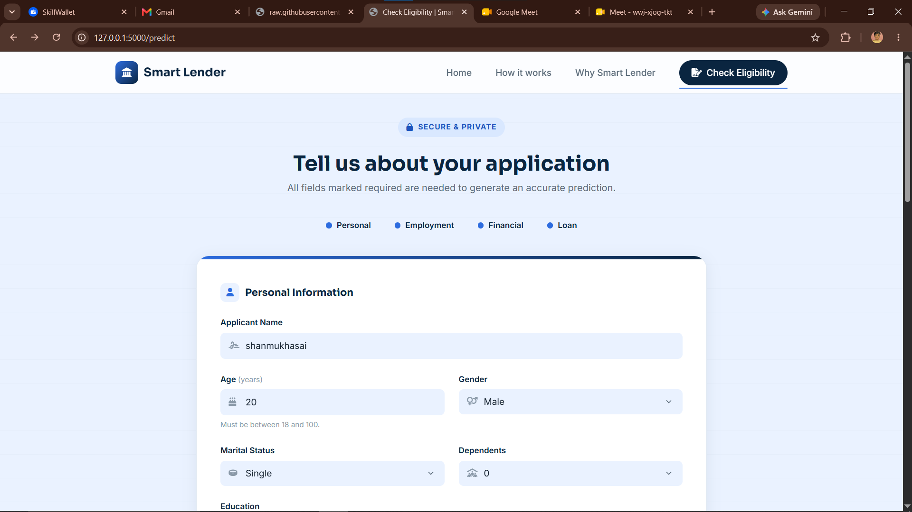
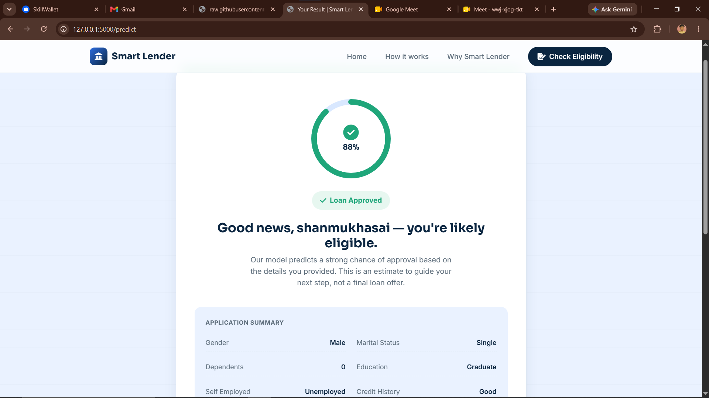

# Smart Lender — Loan Eligibility Prediction System

Smart Lender is a full-stack web application that predicts loan eligibility in real time using a trained machine learning model. It combines a Flask backend, a tuned XGBoost classifier, a MySQL database for application history, and a responsive, banking-themed frontend.

Applicants fill out a multi-section loan application form, and the system returns an instant eligibility prediction with a confidence score — backed by a model trained and compared across four algorithms on a 20,000-record synthetic banking dataset.

---

## Table of Contents

- [Features](#features)
- [Technologies Used](#technologies-used)
- [Folder Structure](#folder-structure)
- [Model Performance](#model-performance)
- [Installation](#installation)
- [Running the Application](#running-the-application)
- [Screenshots](#screenshots)
- [Project Notes](#project-notes)

---

## Features

- **Instant loan eligibility prediction** powered by a tuned XGBoost classifier, with an approval/rejection result and confidence score returned in real time.
- **Multi-section application form** covering personal information, employment details, financial profile, and loan/property details, with full client-side and server-side validation.
- **Automatic feature engineering** — derived credit-risk ratios (loan-to-income, collateral-to-loan, net disposable income, income per dependent) are computed identically at training time and at prediction time, so live requests are preprocessed exactly like the training data.
- **Application history in MySQL** — every submitted application, along with its prediction and probability, is saved to a `loan_applications` table using parameterized queries.
- **Resilient by design** — database connectivity issues are logged and never block a user from seeing their prediction result; invalid or missing form input is caught and reported with a clear, specific error message instead of a server crash.
- **Model comparison pipeline** — Decision Tree, Random Forest, K-Nearest Neighbors, and XGBoost are all trained and evaluated on the same data split; only the best-performing model is saved and served.
- **Hyperparameter-tuned final model** — the XGBoost model is tuned via `RandomizedSearchCV` with Stratified K-Fold cross-validation, then retrained with early stopping on a held-out validation split.
- **Responsive, banking-themed UI** — a custom "ledger" design system with smooth animations, an animated eligibility gauge on the results page, and a mobile-friendly layout.

---

## Technologies Used

**Backend**
- Python 3.10+
- Flask — web framework and routing
- MySQL — relational database for storing loan applications
- mysql-connector-python — MySQL driver

**Machine Learning**
- scikit-learn — Decision Tree, Random Forest, KNN, preprocessing, model selection, and evaluation metrics
- XGBoost — final tuned classifier
- pandas — data loading, cleaning, and feature engineering
- NumPy — numerical operations and synthetic dataset generation

**Frontend**
- HTML5 / Jinja2 templates
- CSS3 (custom design system, no framework)
- Vanilla JavaScript
- Font Awesome — icons

---

## Folder Structure

```
smart-lender/
│
├── app.py                     # Flask application: routes, validation, prediction, MySQL saving
├── database_v2.sql            # MySQL schema for the loan_applications table
├── generate_dataset.py        # Generates the synthetic loan_dataset.csv
├── requirements.txt           # Python dependencies
│
├── dataset/
│   └── loan_dataset.csv       # Generated synthetic dataset (20,000+ records)
│
├── ml/
│   ├── preprocess.py          # Cleaning, feature engineering, encoding -> X.pkl / y.pkl
│   ├── train.py                # Trains & compares 4 models, tunes XGBoost, saves the best
│   └── model/
│       ├── X.pkl               # Preprocessed feature matrix
│       ├── y.pkl                # Target vector
│       ├── cleaned_dataset.csv  # Cleaned, encoded dataset (CSV form)
│       └── loan_model.pkl       # Final trained model used by app.py
│
├── templates/
│   ├── index.html              # Landing page
│   ├── predict.html            # Loan application form
│   └── result.html             # Prediction result page
│
└── static/
    ├── css/
    │   └── style.css           # Design system and page styling
    └── js/
        └── script.js            # Form handling, nav, and result-page animation
```

---

## Model Performance

The training pipeline (`ml/train.py`) trains and evaluates four algorithms on an 80/20 stratified train-test split, with Stratified 5-Fold cross-validation. The best-performing model is selected automatically (highest test accuracy, tie-broken by F1 score) and saved as `ml/model/loan_model.pkl`.

| Model | Accuracy | Precision | Recall | F1 Score | ROC-AUC | CV Accuracy |
|---|---|---|---|---|---|---|
| Decision Tree | 76.80% | 76.81% | 76.80% | 76.80% | 76.69% | 76.98% |
| Random Forest | 84.09% | 84.08% | 84.09% | 84.07% | 92.71% | 83.73% |
| K-Nearest Neighbors | 81.80% | 81.90% | 81.80% | 81.70% | 90.25% | 80.53% |
| **XGBoost (selected)** | **84.84%** | **84.83%** | **84.84%** | **84.83%** | **93.21%** | **82.96%** |

**Final selected model: XGBoost**
- **Test Accuracy:** 84.84%
- **Cross-Validation Accuracy:** 82.96%

XGBoost is tuned using `RandomizedSearchCV` over a wide hyperparameter space with Stratified K-Fold cross-validation, then retrained with early stopping on a held-out validation split carved from the training data, so the reported test metrics are never influenced by early-stopping decisions.

> **Note:** Re-running `ml/train.py` may produce slightly different cross-validation figures from one run to the next, since `RandomizedSearchCV` samples a random subset of the hyperparameter space — the table above reflects a representative real training run.

---

## Installation

### Prerequisites

- Python 3.10+
- MySQL Server 8.0+ (or MariaDB equivalent)
- pip

### 1. Clone the project and set up a virtual environment

```bash
git clone <your-repository-url>
cd smart-lender

python3 -m venv venv
source venv/bin/activate      # On Windows: venv\Scripts\activate
```

### 2. Install dependencies

```bash
pip install -r requirements.txt
```

### 3. Set up the MySQL database

Create the database and table using the provided schema:

```bash
mysql -u root -p -e "CREATE DATABASE IF NOT EXISTS smart_lender;"
mysql -u root -p smart_lender < database_v2.sql
```

### 4. Configure database credentials

`app.py` reads its MySQL connection settings from environment variables, falling back to local defaults if they aren't set:

| Variable | Default | Description |
|---|---|---|
| `DB_HOST` | `localhost` | MySQL host |
| `DB_USER` | `root` | MySQL username |
| `DB_PASSWORD` | *(empty)* | MySQL password |
| `DB_NAME` | `smart_lender` | Database name |

Set these to match your MySQL setup, for example:

```bash
export DB_HOST=localhost
export DB_USER=root
export DB_PASSWORD=your_password
export DB_NAME=smart_lender
```

### 5. Generate the dataset and train the model

If `ml/model/loan_model.pkl` is not already present, generate the data and run the training pipeline:

```bash
python generate_dataset.py
python ml/preprocess.py
python ml/train.py
```

This produces `dataset/loan_dataset.csv`, the preprocessed `X.pkl` / `y.pkl` files, and the final `ml/model/loan_model.pkl` used by the Flask app.

---

## Running the Application

```bash
python app.py
```

By default, the app runs at `http://localhost:5000`. Open this in a browser, fill out the loan application form at `/predict`, and submit it to see an instant eligibility result.

---

## Screenshots


| Page | Preview |
|---|---|
| Landing page | |
| Loan application form | |
| Prediction result | |

---

## Project Notes

- The dataset is synthetically generated (`generate_dataset.py`) using weighted business rules — approval likelihood is driven primarily by credit score, income, debt-to-income ratio, credit history, employment stability, existing EMI, previous defaults, bank balance, and collateral value — with controlled randomness so the data remains realistic without being either trivially separable or unlearnable.
- `ml/preprocess.py` and `app.py` must always stay in sync on feature encoding and engineering: any change to one (e.g. adding a new engineered feature) requires the same change in the other, since `app.py` rebuilds the model's input vector independently at prediction time rather than reusing `preprocess.py` directly.
- This project is for educational and demonstration purposes. Predictions are estimates generated by a model trained on synthetic data and are not a real lending decision from any financial institution.